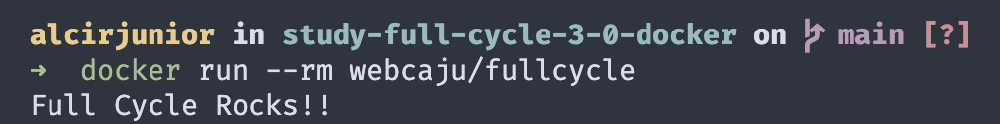

# Curso Full Cycle 3.0 - Módulo Docker - (Desafio GO)

<div>
    
    
</div>

---

## Descrição

O Curso Full Cycle é uma formação completa para fazer com que pessoas desenvolvedoras sejam capazes de trabalhar em projetos expressivos sendo capazes de desenvolver aplicações de grande porte utilizando de boas práticas de desenvolvimento.

---

## Repositório Pai
https://github.com/alcir-junior-caju/study-full-cycle-3-0

---

## Link da Imagem
https://hub.docker.com/r/webcaju/fullcycle

---

## Como usar

Baixe a imagem:
```shell
docker push webcaju/fullcycle:latest
```

Executa a imagem:
```shell
docker run --rm webcaju/fullcycle
```

Resultado em tela:
<p align="center">
    
</p>

Tamanho da Imagem:
<p align="center">
    
</p>
